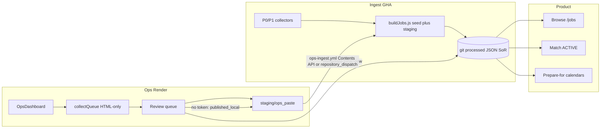
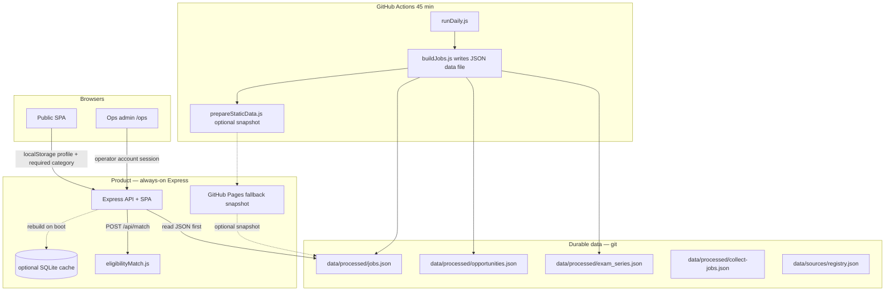
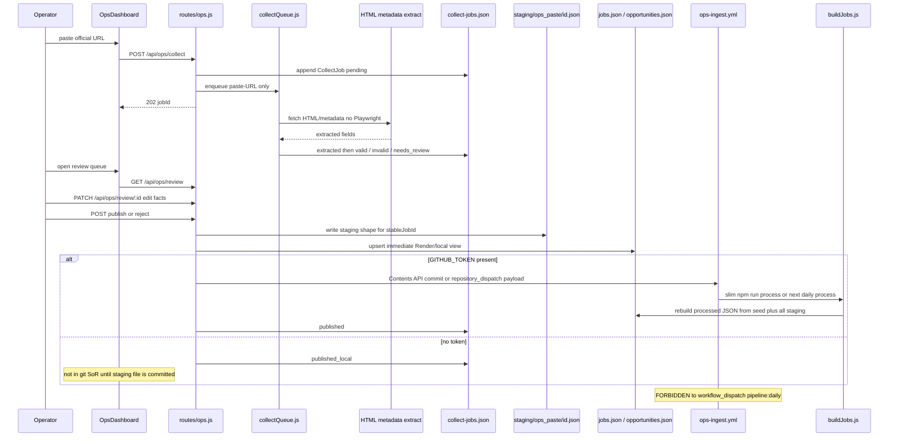
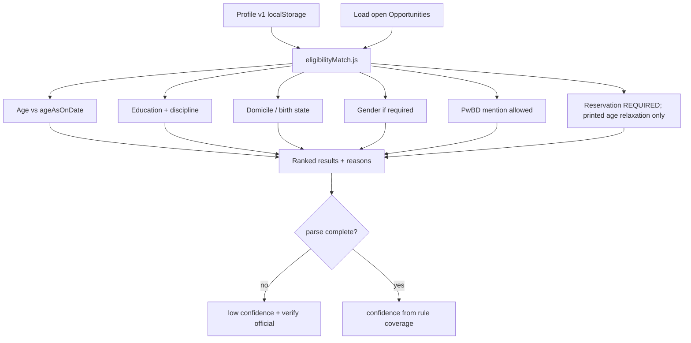

# Expand NoExam Sarkari Jobs Portal to All Indian Government Jobs

| Field | Value |
| --- | --- |
| Document | Design: All-India Govt Jobs + Eligibility Match + Operator Scraper Dashboard |
| Product | NoExam Sarkari Jobs Portal |
| Repo | `C:\Users\Timus97\Desktop\grokAnalysis\GovtJobsPortal` |
| Date | 2026-08-18 (status updated 2026-08-20 after Stage 7) |
| Status | Accepted. **Implementation complete:** PR01–PR08, PR09a, PR09b, PR09c, PR10 are on `master`. No further design-plan PRs. |
| Author | Systems Architecture |
| Audience | Engineers operating and extending the shipped v1 |
| Horizon | Stages 0–6; v1 target 2,000–10,000 opportunities + ~200 exam series |
| Session knowledge | [docs/knowledge/2026-08-19-session-all-govt-jobs-expansion.md](knowledge/2026-08-19-session-all-govt-jobs-expansion.md) |
| Next stage | **Stage 7 complete** ([STUDENT_COACHING_DESIGN.md](STUDENT_COACHING_DESIGN.md) PR11–PR16 + `STUDENT_STORE`). Remaining work is operational: live collect / PDF TTL / always-on host + disk or Postgres. |

---

## 1. Title & Metadata

This document specifies how the existing no-exam-only portal becomes a full Indian government-jobs product: currently-open applications (exam and non-exam), future-exam recommendations from official calendars, explainable eligibility matching against a local profile, and an authenticated operator dashboard that accepts a paste-a-URL scrape with review-before-publish.

Locked defaults (owner-resolved 2026-08-18; do not re-litigate in implementation PRs):

- **Git JSON is the durable data file.** `data/processed/*.json` committed by GHA is what the next collect and a restarted API share. `buildJobs.js` rebuilds it from **seed + staging** (including `data/staging/ops_paste/`). SQLite via `better-sqlite3` is an **optional derived cache** on the Express host only, rebuilt from JSON on API boot, never shipped as the product artifact, never installed in the root/GHA pipeline. **Never** `workflow_dispatch` `pipeline:daily` as ops write-through.
- **Product target is fullstack:** always-on Express API + SPA (Render or equivalent). Static GitHub Pages may remain a fallback snapshot; it is **not** the v1 product. `FEATURE_SERVER_MATCH` is **on**. Matching runs on the server.
- Two first-class entities: **Opportunity** (live apply window) and **ExamSeries** (recurring calendar row).
- `hasExam` is a filter, never a drop rule. **`/jobs` defaults to `hasExam=all` immediately** when Stage 0 lands (no 7-day no-exam grace).
- Matching is rule-based and explainable. Never invent eligibility. Incomplete parse → low confidence + “verify on official”.
- Age uses the notification’s `ageAsOnDate`.
- **`reservationCategory` is required** on the profile (`UR|EWS|OBC|SC|ST`) before matching. Used only for printed age-relaxation tables. Never invent relaxations.
- Profile v1 lives in `localStorage` only. No public candidate accounts. No server-side candidate PII.
- PwBD v1 was mention-only. **Stage 6 is implemented:** post-wise PwBD when `posts[]` list explicit flags; incomplete lists stay at “verify official”.
- **Ops auth is a real admin:** operator user table (or better-auth) with username + hashed password, session cookie signed with `SESSION_SECRET`, `role=operator`. Shared `OPERATOR_PASSWORD` is **bootstrap only** to create the first admin.
- Legal: rate-limit collectors, store metadata + official URLs only, **PDFs in private raw staging + 30-day TTL, never on Pages / public export**, show disclaimer.
- **UGC NET is a prepare-for ExamSeries immediately** (not a vacancy, not behind `FEATURE_UGC_NET=off`).
- Source catalog is `data/sources/registry.json` (one file). SQLite `sources` is a projection of it.

---

## 2. Overview

Today the pipeline **drops** any job whose title/body matches exam patterns (CBT, GATE, UPSC, SSC, IBPS, written). That is why the snapshot is 627 jobs / 562 open / 586 PSU — almost entirely walk-in / interview / application-only PSU posts.

The product change is three surfaces on one pipeline:

1. **Browse all open applications.** Exam and no-exam. Same `/jobs` list, new filter.
2. **Match me.** Candidate stores DOB, education, state, **required** reservation category, optional gender / PwBD in `localStorage`. Express `POST /api/match` scores currently-open Opportunities. Static Pages is a fallback snapshot only.
3. **Prepare for.** ExamSeries rows from official calendars (UPSC, SSC, IBPS, RRB, SBI, later PSC). Not apply-now; “expected window, start preparing.”

Operators get `/ops` to paste a careers URL, watch an async collect job, and publish only after review. Durable publish writes `data/staging/ops_paste/<stableJobId>.json` into git via dedicated `ops-ingest.yml`. `buildJobs.js` then picks it up like any other staging file. Without a GitHub token the row is `published_local` (Render-only) until that staging file is committed.



Quantified v1 envelope:

| Metric | Target |
| --- | --- |
| Opportunities in git JSON SoR | 2,000–10,000 |
| ExamSeries rows | ~200 |
| Sources (existing + new) | `data/sources/registry.json`: 264 today / 200 enabled + P0 boards + PSC rows |
| Match p95 (profile vs open set) | < 200 ms |
| Collect wall clock | Fit existing `daily-collect.yml` 45 min timeout, or split jobs |
| Processed JSON + raw staging year 1 | < 2 GB (optional SQLite cache is a rebuild, not a second store) |
| Current baseline | 627 jobs, 562 open, last run 2026-07-11 |

---

## 3. Background

### 3.1 What exists

| Layer | Path | Behavior |
| --- | --- | --- |
| SPA | `client/` React 19 + Vite 8 | Routes in `client/src/App.jsx`: `/`, `/jobs`, `/jobs/:id`, `/process`, `/sources`, `/about` |
| API client | `client/src/api/jobs.js` | Tries live API, falls back to `client/public/data/*.json` |
| Server | `server/src/index.js` | Express on `:4000` |
| Job routes | `server/src/routes/jobs.js` | `GET /api/jobs` (filters, hides closed), `/jobs/:id`, `/meta/filters`, `/stats`, `/pipeline`, `/sources`, `/health` |
| Store | `server/src/services/jobStore.js` | Re-reads `data/processed/jobs.json` on every request. No SQL. **This git JSON is today’s only durable store.** |
| Canonical data | `data/processed/jobs.json` | Snapshot: 627 jobs, 562 open, 586 PSU; **548 / 627 have `lastDate: null`** |
| Source catalog | `data/sources/registry.json` | 264 sources, 200 enabled, 259 `psu_careers`, 154 already `P3`. Keys: `sourceId`, `listUrls[]`, `priority` P0–P3, `enabled`, `method`, `cadence`, `render` |
| Collect | `scripts/collect/runDaily.js` | Registers `SPECIAL` collectors under `scripts/collect/collectors/` (`becil.js`, `ncs.js`, `employmentNews.js`, `genericCareers.js`) via the registry |
| Staging | `scripts/collect/lib/rawStore.js` + `toStaging.js` | Raw → classified staging. **`toStaging.js` sets `needsReview` when `hasExam === true` or `!lastDate`.** `data/staging/**` is gitignored |
| Process | `scripts/process/buildJobs.js` | **Drops exam jobs**, overwrites `hasExam: false` on published rows, quarantine, dedupe (`url+title` or `notificationNo`), writes jobs/stats/quarantine/run-report. Reads **seed + staging**, not `jobs.json` |
| QA / alerts | `scripts/qa/schemaCheck.js`, `emailNewJobs.js` | Both still require `hasExam === false` |
| Seed | `data/seed/jobs.json` | Includes fake “Management Trainee sample WITH EXAM (should be dropped)” |
| Schema | `shared/jobSchema.js` | `classifySelectionText` + `EXCLUDE_PATTERNS` (CBT/GATE/UPSC/SSC/IBPS/written) → `{ hasExam: true, selectionProcess: null }`; `isValidJob` requires `hasExam===false` and `SELECTION_PROCESSES.includes(selectionProcess)`; `computeStatus(lastDate)`: **null date → `open`** (only `open` \| `closing_soon` \| `closed`); `stableJobId` sha256 |
| Deploy | `.github/workflows/daily-collect.yml` (45 min) + `deploy-pages.yml` | GHA runner is ephemeral; commits `data/processed`, `data/staging`, `data/raw/pdfs`. Root `package.json` has no `better-sqlite3`. `render.yaml` is **free** (ephemeral disk, sleep ~15 min). `prepareStaticData.js`, `emailNewJobs.js` |

### 3.2 Why the current design cannot absorb this product

`shared/jobSchema.js` treats exams as contamination. `toStaging.js`, `buildJobs.js`, `schemaCheck.js`, and `emailNewJobs.js` all enforce that. `jobStore.js` is a full-file JSON read. Adding UPSC/SSC/IBPS calendars on top of a drop-exams pipeline would discard the new data.

The enabled registry is mostly PSU career pages collected by `genericCareers.js`. National boards (UPSC, SSC, IBPS, SBI, RRB) and state PSCs are absent by design. Existing P0s in the registry are `seed_manual`, `ncs_gov`, `employment_news`, `becil` only.

A SQLite file on an ephemeral disk cannot be the SoR. GHA does not persist sqlite. Git JSON is the durable data file the API serves. The **product** is the always-on Express + SPA; Pages is an optional snapshot.

### 3.3 Constraints we keep

- v1 product is fullstack Express + SPA (Render or equivalent **always-on**). Static Pages may stay as a fallback snapshot of the same git JSON; it is not the match or ops host.
- Collectors stay in `scripts/collect/collectors/` and register through `runDaily.js` + `data/sources/registry.json`. No new language runtime.
- Official URLs remain the source of truth. We store metadata, not gazette PDFs.
- 45-minute GitHub Actions budget is a hard ceiling unless we split the workflow.

---

## 4. Goals & Non-Goals

### 4.1 Goals

1. Stop dropping exam-bearing posts. `hasExam` becomes a first-class filter on `/jobs` and `/api/jobs`.
2. Introduce **Opportunity** (apply-now window) and **ExamSeries** (calendar / recurring).
3. Keep git JSON (`data/processed/*.json`) as the durable data file the API serves. Optional SQLite cache on Express only, rebuilt from JSON on boot. Pages snapshot is optional fallback, not the product.
4. Ship P0 official collectors: NCS, Employment News (**narrowed** to the free highlights table — a change from today’s homepage+PDF scrape), UPSC, SSC, IBPS, SBI, RRB, BECIL, plus a calendar-PDF parser. Register them in `data/sources/registry.json` with concrete `listUrls`.
5. Eligibility profile v1 in `localStorage` (**reservationCategory required**) and an explainable **server** matcher for **currently open** Opportunities (`FEATURE_SERVER_MATCH=on`).
6. “Prepare for” recommendations from ExamSeries official calendars, including **UGC NET immediately**.
7. Operator **admin dashboard** with real accounts (hashed passwords, sessions, `role=operator`), paste-a-URL, async extract, review-before-publish.
8. Generic PSC collector driven by **the same** `data/sources/registry.json` (one scraper, many states; no third catalog), plus P1 verticals split across reviewable PRs.
9. Hardening: PwBD post-wise suitability, reservation-category precision, QA fixtures.

### 4.2 Non-Goals (v1)

- Public user accounts, cloud profile sync, or any server-side PII store.
- Republishing official PDFs, hall tickets, or full notification text.
- CAPTCHA bypass on defence portals (`joinindianarmy.nic.in` and similar). Calendar/manual only.
- Treating CUET as a job. CUET is admissions — exclude from match.
- Treating UGC NET as a **vacancy / Opportunity**. It is an ExamSeries (prepare-for) from day one.
- Per-state custom scrapers (28 PSC spiders). One generic + registry.
- ML / LLM eligibility inference. Rules only.
- Post-wise PwBD suitability matrix before Stage 6.
- Real-time apply, OAuth to board sites, or payment of application fees.
- Postgres, Redis, or a separate worker cluster in v1.
- SQLite as a durable SoR on free Render (ephemeral disk + sleep). Persistent-disk SQLite is an alternative we rejected for v1; see §12.1.
- NLP-parsing free-text `eligibility[]` into age/EQ/domicile in v1.
- Playwright on the Render free box (not installed; paste-URL is HTML/metadata only).

### 4.3 Success criteria

- A candidate with a **complete** profile (including reservation category) sees a ranked, explained list of open Opportunities from `POST /api/match` in < 200 ms p95 against the v1 corpus.
- `/jobs` lists **all** jobs (exam + no-exam) as soon as Stage 0 lands; users can still filter to no-exam.
- At least the P0 boards produce both Opportunities and ExamSeries without breaking the 45-minute collect job. UGC NET appears on Prepare-for.
- Operators sign in with individual accounts, paste a URL, see `pending → extracted → valid|invalid|needs_review`, and publish or reject.
- Always-on API serves git JSON. Processed JSON + raw staging stay under 2 GB in year 1. Catalog rows committed to git survive API restart. PDFs stay in private raw staging (30-day TTL) and never ship publicly.

---

## 5. Proposed Design

### 5.1 Runtime topology

Git JSON (`data/processed/*.json` committed by GHA) is the durable data file. The **product** is always-on Express + SPA. SQLite is an optional Express cache rebuilt **from** that JSON on boot. Static Pages is a fallback snapshot only. GHA never installs `better-sqlite3`.



### 5.2 Collect → review → publish

Paste-URL only. Daily collect does **not** create `collect_jobs` rows (that would be thousands of PSU reviews). Playwright stays in GHA; Render paste-URL is **HTML/metadata only** (`render.yaml` does not install Playwright).



### 5.3 Match path (ACTIVE opportunities only)



### 5.4 Module map

New collectors live in `scripts/collect/collectors/` (same folder as existing `becil.js` / `ncs.js`) and register via `runDaily.js` `SPECIAL` + `data/sources/registry.json`. Do **not** add `scripts/collect/registry/psc.json`.

| New or changed path | Role |
| --- | --- |
| `shared/jobSchema.js` | Keep `stableJobId`, `computeStatus` (null lastDate → `open`). `classifySelectionText` maps `EXCLUDE_PATTERNS` onto new **string** codes. `selectionProcess` stays a primary string. |
| `shared/opportunitySchema.js` | Canonical Opportunity. Optional `selectionProcesses[]`. Eligibility facts, official URLs. |
| `shared/examSeriesSchema.js` | Recurring calendar entity. Board, exam name, cycle, expected dates. |
| `shared/eligibilityFacts.js` | Ordinal education ladder + structured-fact helpers. **No NLP** of `eligibility[]` in v1. |
| `shared/eligibilityMatch.js` | Pure ESM functions. **v1 product path is `POST /api/match`.** Same module may be imported by a Pages snapshot if kept. |
| `client/vite.config.js` | Alias `@shared` → `../shared` so the ESM client can import match/facts. |
| `server/src/db/sqlite.js` | Optional `better-sqlite3` cache (server package only). Not used by GHA. |
| `server/src/routes/jobs.js` | Add `hasExam`, `selectionProcess` (string), entity-type filters. Stop hiding exams. |
| `server/src/routes/match.js` | Optional server match. Accepts profile in POST body; does not persist it. |
| `server/src/routes/ops.js` | Operator accounts (hashed password, session, `role=operator`). Bootstrap `OPERATOR_PASSWORD` creates the first admin only. Paste-URL, PATCH review, publish/reject. |
| `server/src/db/operators` or better-auth | Operator user table: `id`, `username`, `passwordHash`, `role`, `createdAt`. Not the candidate profile. |
| `server/src/services/jobStore.js` | **Reads JSON first** (`data/processed/jobs.json`). Optional SQLite cache if rebuilt on boot. |
| `server/src/services/collectQueue.js` | In-process async queue for **paste-URL only**. Not daily collect. |
| `scripts/migrate/jsonToSqlite.js` | Optional Express-boot cache rebuild from git JSON. Not a second writer. |
| `scripts/process/buildJobs.js` | Writes **JSON SoR only**. Quarantine stays. Do not drop `hasExam===true`. Do not overwrite `hasExam: false`. |
| `scripts/collect/lib/toStaging.js` | Stop forcing `needsReview` / exam-drop when `hasExam === true`. |
| `scripts/qa/schemaCheck.js` | Allow `hasExam === true` when a valid selection code is present. |
| `scripts/collect/runDaily.js` | Register new collectors in `SPECIAL`. Respect 45 min; split if needed. |
| `scripts/collect/collectors/upsc.js` | UPSC exam-calendar, active-exams, upsconline.nic.in. |
| `scripts/collect/collectors/ssc.js` | ssc.gov.in calendar + notice-board (JS-heavy → Playwright **in GHA**). |
| `scripts/collect/collectors/ibps.js` | ibps.in + calendar PDF. |
| `scripts/collect/collectors/sbi.js` | sbi.co.in/web/careers/current-openings + recruitment.sbi.bank.in. |
| `scripts/collect/collectors/rrb.js` | rrbapply.gov.in + zonal sites. Not rrbcdg.gov.in as national API. |
| `scripts/collect/lib/calendarPdf.js` | Shared PDF table parser for official calendars (GHA). Metadata only. |
| `scripts/collect/collectors/genericPsc.js` | Registry-driven state PSC spider; rows live in `data/sources/registry.json`. |
| `data/sources/registry.json` | **The** source catalog. Extend with `autoPublish`, `rateLimitMs`, `collector`. Keep `listUrls`, `enabled`, `cadence`, `category`, `priority` P0–P3. |
| `data/processed/collect-jobs.json` | Paste-URL review state (local / Render). Not the catalog SoR. |
| `data/staging/ops_paste/<stableJobId>.json` | Durable paste publish input. Same staging shape `buildJobs.js` already walks. |
| `.github/workflows/ops-ingest.yml` | Commits the staging file (Contents API or `repository_dispatch` payload). **Not** `pipeline:daily`. |
| `client/src/components/JobFilters.jsx` | Exam / no-exam filter (not only `App.jsx`). |
| `client/src/pages/JobsPage.jsx` | Default filter `hasExam=all` immediately (Stage 0). |
| `client/src/utils/labels.js` | Labels for new selection codes + hasExam. |
| `client/src/pages/ProfilePage` | Edit profile v1; persist localStorage. |
| `client/src/pages/MatchResultsPage` | Ranked ACTIVE matches + chips + persistent banner. |
| `client/src/pages/PreparePage` | ExamSeries list + “prepare for” reasons. |
| `client/src/pages/ops/OpsDashboard` | Paste URL, job list, source health. |
| `client/src/pages/ops/OpsRunDetail` | Single collect job timeline. |
| `client/src/pages/ops/OpsReviewQueue` | valid / needs_review; PATCH facts; publish-or-reject. |

### 5.5 Selection process codes (expanded)

Existing no-exam codes stay. New codes (filterable, not drop rules):

| Code | Meaning |
| --- | --- |
| `cbt` | Computer-based test |
| `written_multi_stage` | Multi-stage written (prelims/mains) |
| `interview_after_exam` | Exam then interview |
| `physical` | PET/PST/medical |
| plus existing no-exam codes | Interview-only, screening of applications, walk-in, etc. |

`jobs.json` keeps `selectionProcess` as a **primary string** (compat with `isValidJob`, `jobStore` equality filter, `JobFilters`). `classifySelectionText` maps each `EXCLUDE_PATTERNS` hit onto one of the new string codes (e.g. CBT → `cbt`, UPSC/SSC/IBPS/written multi-stage → `written_multi_stage`). Opportunity may also carry optional `selectionProcesses[]` when a notification lists more than one stage. Filters query the string field first.

### 5.6 Write contract (git JSON is SoR)

Every successful `buildJobs.js` run writes **JSON only** (this is the durable store GHA commits):

1. Writes `data/processed/jobs.json` (compat; includes exam jobs; `selectionProcess` is a string).
2. Writes `data/processed/opportunities.json` and `data/processed/exam_series.json`.
3. Writes stats, quarantine, run-report as today.
4. Does **not** open SQLite. GHA does **not** install `better-sqlite3`.
5. `prepareStaticData.js` copies those JSON files into `client/public/data/`. Pages never ships a `.sqlite` file.

`jobStore.js` reads git JSON first. If the Express process has optionally run `scripts/migrate/jsonToSqlite.js` on boot, it may use SQLite as a **read cache** of that same JSON. The cache is discarded on Render sleep/redeploy and rebuilt from JSON. `jsonToSqlite.js` is not a second writer.

`buildJobs.js` **continues to read seed + all staging** (including `data/staging/ops_paste/`). It does **not** merge already-published `opportunities.json` as a third input in v1. Unpublish (Stage 6) removes or tombstones the staging file and re-runs process; do not invent a processed-JSON union until then.

**Ops publish contract (PR08) — option 1, required:**

1. Write `data/staging/ops_paste/<stableJobId>.json` in the same staging shape `buildJobs.js` already walks.
2. Also upsert `data/processed/opportunities.json` and `jobs.json` for the immediate local/Render view.
3. Durable path to git: dedicated workflow `.github/workflows/ops-ingest.yml`. The ops API commits/pushes the staging file via the GitHub Contents API **or** fires `repository_dispatch` with the JSON payload. `data/staging/**` is gitignored in the working tree; `ops-ingest.yml` **force-adds** `data/staging/ops_paste/` (same pattern as `daily-collect.yml` already committing staging). `buildJobs.js` then picks it up on the next process run — scheduled `pipeline:daily` **process step**, or a slim `npm run process` workflow triggered by `ops-ingest.yml`.
4. **Forbidden:** `workflow_dispatch` of `pipeline:daily` as write-through. That workflow checks out git, collects on an empty runner staging tree, and **overwrites** `data/processed/jobs.json`, deleting the paste row.
5. If `GITHUB_TOKEN` / Contents credentials are missing (local-only operator), mark the CollectJob `published_local` and show **“not in git SoR until staging file is committed.”** A Render-only processed-JSON upsert without the staging file is lost on the next `buildJobs` run and is **not** the catalog.

---

## 6. Eligibility matching rules

Modules: `shared/eligibilityMatch.js` (pure ESM matcher) + `shared/eligibilityFacts.js` (ladder + structured-fact helpers). Deterministic. Unit-tested with **hand-built golden fixtures** in PR05 — live P0 collectors do **not** fill age/EQ tables in v1.

### 6.1 Profile v1 (localStorage key `sarkari.profile.v1`)

| Field | Required | Notes |
| --- | --- | --- |
| `dob` | yes | ISO date. Age computed against notification `ageAsOnDate`, not “today”. |
| `highestEducation` | yes | Same ladder as Opportunity `minEducation` (see §6.2) |
| `educationDiscipline` | no | Free-ish token: `engineering`, `commerce`, `arts`, `science`, `law`, `medical`, `any` |
| `birthState` | yes | State/UT code |
| `domicileStates` | yes | Array; may include `birthState` |
| `gender` | no | `male`, `female`, `other`. Missing → fail only posts that require a specific gender. |
| `pwbd` | no | `{ hasDisability, category: VH\|HH\|OH\|others\|none }` |
| `reservationCategory` | **yes** | `UR\|EWS\|OBC\|SC\|ST`. Match is disabled until the user picks one. Used only against **printed** `ageRelaxation` tables. Never invent a relaxation. |

Profile UI: category is a required select. Copy: **“Category is required to match. We only apply age relaxation when the official notification prints it for your category. We never invent relaxations.”** Match CTA stays disabled until `reservationCategory` is set. Incomplete profile → do not call `/api/match`.

No public candidate accounts. Profile never POST-persisted. `POST /api/match` accepts the object in-memory for the request only and **400s** if `reservationCategory` is missing.

### 6.2 Facts extracted onto an Opportunity (`shared/eligibilityFacts.js`)

Only persist facts present as **already-structured** fields (`job.qualification`, printed age columns if a later PR extracts them, explicit flags). **Do not NLP-parse `eligibility[]` in v1.** Today 608 / 627 jobs have `qualification: null` and eligibility is a free-text `string[]`. Those rows ship with `eligibilityParse.complete = false`. P0 collectors in PR03–PR04 also ship `eligibilityParse.complete = false` until a later extractor exists.

Education ordinal (one ladder, profile **and** Opportunity; maps live `QUALIFICATIONS` including `iti` and `pg` ↔ `postgraduate`):

| Rank | Code | Notes |
| --- | --- | --- |
| 0 | `below_10` | |
| 1 | `10th` | |
| 2 | `12th` | |
| 3 | `iti` | Live vocab; was missing from the first profile enum |
| 4 | `diploma` | |
| 5 | `graduate` | |
| 6 | `pg` / `postgraduate` | Treat as the same rank |
| 7 | `phd` | |
| 8 | `experience` | Not an education floor; do not compare with `≥` against school/degree ranks |

`minEducation` is copied from `job.qualification` when that field is one of the codes above; otherwise `null`. Discipline is **not** inferred from free text in v1.

| Fact | Source in v1 |
| --- | --- |
| `ageMin`, `ageMax`, `ageAsOnDate` | Structured extract only; else null |
| `ageRelaxation` | Map by category if printed as structured data; else null |
| `minEducation`, `disciplineRequired` | `qualification` code / explicit field; else null |
| `genderRequired` | Only if the post is explicitly men-only / women-only |
| `domicileRequired`, `domicileStates` | State-cadre / local posts when structured |
| `pwbdAllowed` | Boolean if notification mentions PwBD vacancies; else null |
| `pwbdCategories` | If listed; else null (Stage 6 fills post-wise) |
| `applicationOpen`, `applicationClose` | Apply window / `lastDate` |
| `officialUrl`, `notificationUrl` | Required |
| `eligibilityParse.complete` | `true` only when age band + education + close date are all structured |

### 6.3 Rule table (v1)

| Rule | Pass | Fail | Unknown |
| --- | --- | --- | --- |
| Status (browse `/jobs`) | `computeStatus(lastDate)` as today: **null lastDate → `open`**, listed | `closed` only | — |
| Status (ACTIVE match) | close date present and `computeStatus` is `open` or `closing_soon` | `closed` | **missing close date: include the row**, `outcome=unknown`, confidence penalty, chip **“Last date not listed — verify on official site”**. Do not call them `open` in match copy. |
| Upcoming | `applicationOpen > today` only | — | no `upcoming` status in `computeStatus`; do not invent one |
| Age | age on `ageAsOnDate` in [min, max] after relaxation | outside band | missing `ageAsOnDate` or band |
| Education | profile `highestEducation` ≥ required on the shared ladder | below | required not parsed; `experience` vs degree is unknown, not ≥ |
| Discipline | no requirement, or profile matches / is `any` | explicit mismatch | requirement text unparsed (the v1 default) |
| Domicile | no requirement, or intersection with `domicileStates` / `birthState` | required and no overlap | “local candidate” text without states |
| Gender | no requirement, or match | required and mismatch / profile gender missing | — |
| PwBD | `pwbdAllowed` true, or profile `hasDisability` false | profile has disability and `pwbdAllowed === false` | `pwbdAllowed` null → unknown, not fail |
| Category | required on profile; apply printed `ageRelaxation[category]` when present | never invent a band or relaxation; never auto-fail reserved-only posts in v1 (Stage 6) | relaxation table not printed |

**Do not change `computeStatus` to fail-closed on missing dates.** That would empty `/jobs` (548 / 627 rows have `lastDate: null`).

**Hard rule:** never invent a relaxation or a qualification. Unknown ≠ fail. Unknown lowers confidence and adds `verify-on-official`.

### 6.4 Scoring

```
confidence = coveredRules / applicableRules   // unknown does not count as covered
score = 100 * confidence * (fails === 0 ? 1 : 0)
```

Missing close date is an applicable Status rule that is **unknown**, so it penalizes confidence. Almost all of today’s 627 will land in the low-confidence bucket until facts exist — that is acceptable. PR05 ships **hand-built golden fixtures** (real notifications with structured age/EQ/dates) so the engine is demonstrable without pretending collectors fill facts.

- `fails > 0` → excluded from default “You can apply” list; available under “Did not match” with reasons.
- `fails === 0` and `confidence < 0.6` → include with badge **Low confidence — verify on official site**.
- `fails === 0` and `confidence ≥ 0.6` → ranked by close date (sooner first; missing dates last), then score.

Each result returns `reasons[]`: `{ rule, outcome: pass|fail|unknown, detail }`. The UI renders these as chips. Copy is factual (“Age 28 on 2026-08-01 is within 21–30”) not marketing.

`MatchResultsPage` has a **persistent banner** (not only a footer): **“Not an official eligibility decision.”** Post-wise PwBD and reserved-only apply only when those facts are structured on the notification.

### 6.5 ACTIVE vs prepare-for

| Surface | Input | Output |
| --- | --- | --- |
| MatchResultsPage | Profile + Opportunities that are not `closed` (includes null lastDate, with Status=unknown) | Ranked apply-now list + banner |
| PreparePage | Profile + ExamSeries | Calendars whose typical education floor is met; no age fail against *expected* `ageAsOnDate` if known |

ExamSeries matching is advisory. Missing age-as-on for a future cycle is normal → do not fail; say “age will be computed when notification is out”.

### 6.6 What we will not do

- Infer GATE paper or engineering branch from a free-text resume.
- Run a match without `reservationCategory`.
- Invent an age relaxation that is not printed on the notification for that category.
- Mark PwBD-suitable for a specific post before Stage 6.
- Scrape or store candidate documents.

---

## 7. Collector dashboard UX

Routes (gated): `/ops`, `/ops/runs/:id`, `/ops/review`. Components: `OpsDashboard`, `OpsRunDetail`, `OpsReviewQueue`, plus a minimal operator-account screen (`/ops/login`, first-run bootstrap).

**v1 auth (PR07) — real admin, not a shared password as the end state:**

- Store: operator user table (SQLite cache file **or** a small `data/ops/operators.json` with hashes — implementer pick; better-auth is acceptable). Columns: `id`, `username`, `passwordHash` (scrypt/argon2), `role` (`operator` | `admin`), `createdAt`.
- `POST /api/ops/login` `{ username, password }` → httpOnly session cookie signed with `SESSION_SECRET`. Cookie: Secure in prod, SameSite=Lax, new id on login, idle TTL 12 h. CSRF: SameSite=Lax while ops is same-origin.
- `OPERATOR_PASSWORD` (env) is **bootstrap only**: if the operator table is empty, a one-time setup accepts that password to create the first `admin` username. After one operator exists, the env password cannot sign in and should be rotated/removed.
- Rate-limit login (5 / 15 min / IP). Unauthenticated requests → 401; SPA redirects to `/ops/login`.
- Do not design PR07 as “shared password now, SSO later maybe.” Individual accounts are the v1 contract. IdP/SSO can replace the password hash later without changing the session/role model.

### 7.1 CollectJob states

```
pending → extracted → valid
                    → invalid
                    → needs_review → published
                                   → published_local
                                   → rejected
         ↘ failed (transport / timeout)
```

| State | Meaning | Operator action |
| --- | --- | --- |
| `pending` | Queued; not fetched | Wait / cancel |
| `extracted` | Raw fields pulled; schema not validated | Automatic |
| `valid` | Passes `opportunitySchema` / `examSeriesSchema`; all required official URLs present | Publish or reject |
| `invalid` | Schema fail or non-official host | Fix source or reject |
| `needs_review` | Extracted but `eligibilityParse.complete === false` or duplicate suspicion | `PATCH` facts or reject |
| `published` | Staging file is in git (`ops_paste/<id>.json`); will survive the next `buildJobs` | None (unpublish is Stage 6) |
| `published_local` | Staging + processed JSON written on this host only; **not** in git SoR | Commit staging or retry with token |
| `rejected` | Terminal; reason required | None |
| `failed` | HTTP/timeout (Render has no Playwright) | Retry |

`collect_jobs` / `data/processed/collect-jobs.json` exist **only for paste-URL**. Daily collect stays on `runDaily.js` → staging → `buildJobs.js` and does **not** create a collect_job per PSU URL. Auto-publish for P0 calendar upserts stays on the GHA `buildJobs` path (`autoPublish: true` on the registry row). Paste-URL is **never** auto-publish.

### 7.2 OpsDashboard layout

1. **Paste bar** — URL input, optional source label, Submit. Client checks `https:` and a host allowlist (gov.in, nic.in, plus listed bank/board hosts). Reject others in UI before POST.
2. **Active jobs** — table: jobId, host, state, startedAt, elapsed.
3. **Source health** — last success, last error, robots/rate-limit flags.
4. **Deep links** — run detail, review queue counts by state.

### 7.3 Paste-URL sequence

1. Operator pastes `https://…` official careers/notification URL.
2. `POST /api/ops/collect` `{ url }` → 202 `{ jobId }`. Append `pending` to `data/processed/collect-jobs.json`.
3. `collectQueue.js` (paste-URL only) picks up. Rate-limit: 1 concurrent paste job, ≥ 5 s between fetches to the same host.
4. Fetcher on Render does **HTML/metadata only** (title, final URL, outbound official links). No Playwright. JS-heavy hosts (SSC) will land in `needs_review` or `failed`; operator uses GHA/Playwright or pastes after a GHA run.
5. **No PDF bytes stored in the public export.** GHA may keep a PDF in private raw staging (`scripts/collect/lib/rawStore.js`) with 30-day TTL; store only extracted fields + official URL in JSON.
6. Transition `extracted` → `valid` | `invalid` | `needs_review`.
7. Operator opens review: outbound official URL + extracted JSON. `PATCH /api/ops/review/:id` edits facts (`opportunitySchema` validation).
8. Publish (required order):
   1. Write `data/staging/ops_paste/<stableJobId>.json` (same staging shape `buildJobs.js` already walks).
   2. Upsert `opportunities.json` / `jobs.json` for immediate local/Render view.
   3. If credentials exist, push that staging file through **`ops-ingest.yml`** (Contents API commit or `repository_dispatch` with the JSON payload) and mark `published`. A slim `npm run process` (or the next daily **process** step) rebuilds processed JSON from seed + all staging, including `ops_paste`.
   4. If no GitHub token: mark `published_local` and show **“not in git SoR until staging file is committed.”**
   5. **Do not** `workflow_dispatch` `pipeline:daily`. That wipes processed JSON.
   Reject requires a reason string.
9. Publish debounce (5 s) so a burst of reviews does not rewrite JSON 50 times.

### 7.4 Review queue UX rules

- Default filter: `needs_review` then `valid`.
- Duplicate suspicion: same `officialUrl` **and** (same title / `stableJobId` / `notificationNo`) — matching `buildJobs.js` `dedupeKey`. Same careers homepage + different title is **allowed** (NCS × 5, BECIL × 3 in the snapshot).
- Closed-window paste → allow as historical Opportunity but do not surface in ACTIVE match.
- Always show disclaimer preview that the public site will display.

### 7.5 Legal / robots in the UI

Dashboard footer repeats: rate-limited, metadata + official URLs only, no PDF republish, not affiliated with any board. A collect job that hits a non-allowlisted host is `invalid` with `reason=host_not_allowed`.

---

## 8. Official source catalog

Collectors store **metadata and official URLs**. Difficulty is engineering cost, not legal permission to republish content.

### 8.1 P0 — ship in Stages 0–1 / PRs 03–04

| Source | Method | Difficulty | Tier | Notes |
| --- | --- | --- | --- | --- |
| ncs.gov.in | Playwright (existing `collectors/ncs.js`) | M | P0 | Keep; map into Opportunity |
| employmentnews.gov.in + `/newemp/Home.aspx` | HTML table | S | P0 | **CHANGE** to `collectors/employmentNews.js`: today it scrapes homepage links + PDFs. Narrow to the **free highlights table only**. E-paper is paid — do not scrape |
| becil.in | Existing `collectors/becil.js` | S | P0 | Keep |
| upsc.gov.in exam-calendar | HTML + `calendarPdf.js` | M | P0 | ExamSeries |
| upsc.gov.in active-exams | HTML | M | P0 | Opportunity when apply window live |
| upsconline.nic.in | HTML / Playwright | M | P0 | Apply links only |
| ssc.gov.in calendar | Playwright | H | P0 | JS-heavy |
| ssc.gov.in notice-board | Playwright | H | P0 | JS-heavy |
| ibps.in | HTML | M | P0 | CRP cycles |
| IBPS_CALENDAR_2026-27_final.pdf | `calendarPdf.js` | M | P0 | Metadata; do not host the PDF |
| sbi.co.in/web/careers/current-openings | HTML | M | P0 | Opportunity |
| recruitment.sbi.bank.in | HTML | M | P0 | Apply host |
| rrbapply.gov.in | HTML / Playwright | H | P0 | National apply |
| zonal e.g. rrbchennai.gov.in | HTML | M | P0 | Zonal notices |
| **not** rrbcdg.gov.in as national API | — | — | — | Chandigarh zonal only |

### 8.2 P1 — Stage 5 / PR09

| Source | Method | Difficulty | Tier | Notes |
| --- | --- | --- | --- | --- |
| opportunities.rbi.org.in | HTML | M | P1 | |
| NABARD careers | HTML | M | P1 | |
| SEBI careers | HTML | M | P1 | |
| India Post | HTML | M | P1 | |
| KVS / NVS / DSSSB / CTET | HTML + calendar | H | P1 | CTET is eligibility-like; expose as ExamSeries |
| AIIMS / ESIC / NHM | HTML | H | P1 | Many institutes |
| FCI | HTML | M | P1 | |
| LIC | HTML | M | P1 | |
| EPFO | HTML | M | P1 | |
| DRDO / ISRO / BARC | HTML | H | P1 | |
| GATE score gate2027.iitm.ac.in | Calendar + per-PSU careers | H | P1 | GATE is a score, not a vacancy. ExamSeries + PSU Opportunities that cite GATE |
| UGC NET ugcnet.nta.nic.in | Calendar | M | P1 | **ExamSeries immediately (prepare-for). Not a vacancy / Opportunity.** |
| CUET | — | — | EXCLUDE | Admissions. Never in job match |
| joinindianarmy.nic.in | Calendar / manual | H | P1 | CAPTCHA. **No CAPTCHA bypass** |
| joinindiannavy.gov.in | Calendar / manual | H | P1 | |
| careerairforce.nic.in | Calendar / manual | H | P1 | |
| apprenticeshipindia | HTML | M | P1 | Separate type; do not mix with regular vacancies without a type flag |
| eGazette | Metadata / links | H | P1 | Link only |
| PIB | HTML | M | P1 | Discovery, not SoR |
| Existing enabled PSU career pages | `collectors/genericCareers.js` | M | keep registry `priority` | 200 enabled today; **154 are already `P3`** — do not flatten to P1 |

### 8.3 P2 — generic PSC (Stage 5 / PR09a)

One collector: `scripts/collect/collectors/genericPsc.js`. Rows go into **`data/sources/registry.json`** (same schema). **Do not** create `scripts/collect/registry/psc.json`. UPSC index of PSCs: `upsc.gov.in/external-links/state-public-service-commissions`.

| Commission | Typical host pattern | In v1 registry |
| --- | --- | --- |
| UPPSC | uppsc.up.nic.in | yes |
| BPSC | bpsc.bih.nic.in | yes |
| MPSC | mpsc.gov.in | yes |
| TNPSC | tnpsc.gov.in | yes |
| WBPSC | psc.wb.gov.in | yes |
| RPSC | rpsc.rajasthan.gov.in | yes |
| GPSC | gpsc.gujarat.gov.in | yes |
| KPSC (Karnataka) | kpsc.kar.nic.in | yes |
| Kerala PSC | keralapsc.gov.in | yes |
| APPSC | psc.ap.gov.in | yes |
| TSPSC | tspsc.gov.in | yes |
| OPSC | opsc.gov.in | yes |
| MPPSC | mppsc.mp.gov.in | yes |
| HPSC | hpsc.gov.in | yes |
| HPPSC | hppsc.hp.gov.in | yes |
| JPSC | jpsc.gov.in | yes |
| JKPSC | jkpsc.nic.in | yes |
| UKPSC | ukpsc.gov.in | yes |
| CGPSC | psc.cg.gov.in | yes |
| APSC | apsc.nic.in | yes |
| PPSC | ppsc.gov.in | yes |
| NPSC | npsc.nagaland.gov.in | yes |
| Other state/UT PSCs | per UPSC external-links | registry stub, enable when list page parses |

Do **not** write 28 custom spiders. If a commission’s DOM will not yield a list + official URL, leave it `needs_review` / manual paste-URL.

### 8.4 Source catalog (SoR = `data/sources/registry.json`)

The file that actually drives `runDaily.js` is the catalog. Keep existing keys and extend them. SQLite `sources` (if the optional cache is on) is a **projection** of this file.

Existing keys (do not drop): `sourceId`, `name`, `category`, `baseUrl`, `listUrls[]`, `orgTypeDefault`, `sector`, `priority` (`P0|P1|P2|P3`), `method`, `cadence`, `enabled`, `render`, `robotsNotes`, `owner`.

Add: `autoPublish` (boolean), `rateLimitMs` (number), `collector` (module id, e.g. `genericCareers`, `upsc`, `genericPsc`).

`priority` stays **P0–P3**. Optional SQLite `tier` column allows `P3` (do not CHECK only P0–P2). If a UI wants three buckets, document `P3 → “background PSU”`; do not rewrite 154 rows to P2.

Today’s real P0s: `seed_manual`, `ncs_gov`, `employment_news`, `becil`. PR03 adds board rows **before** the spiders run, with concrete `listUrls`:

| `sourceId` | `collector` | Concrete `listUrls` (write these in registry before PR03) |
| --- | --- | --- |
| `upsc_calendar` | `upsc` | `https://upsc.gov.in/examinations/exam-calendar` |
| `upsc_active` | `upsc` | `https://upsc.gov.in/examinations/active-exams` |
| `upsc_online` | `upsc` | `https://upsconline.nic.in/` |
| `ssc_calendar` | `ssc` | `https://ssc.gov.in/` calendar path current at implement time (JS-heavy) |
| `ssc_notices` | `ssc` | `https://ssc.gov.in/` notice-board path current at implement time |
| `ibps_home` | `ibps` | `https://www.ibps.in/` |
| `ibps_calendar` | `ibps` | Durable **listing page** that links the year-stamped PDF (do not treat `IBPS_CALENDAR_2026-27_final.pdf` as a forever URL) |
| `sbi_openings` | `sbi` | `https://sbi.co.in/web/careers/current-openings` |
| `sbi_apply` | `sbi` | `https://recruitment.sbi.bank.in/` |
| `rrb_apply` | `rrb` | `https://www.rrbapply.gov.in/` |
| `rrb_chennai` | `rrb` | `https://www.rrbchennai.gov.in/` (zonal example; add others as enabled) |

`rrbcdg.gov.in` is **not** a registry row for national RRB. Employment News narrowing is a change to `employmentNews.js` + its existing `listUrls`, not a keep.

---

## 9. Stage-by-stage plan

Each stage is independently shippable. Later stages must not rewrite earlier schemas without a migration.

### Stage 0 — Schema, stop dropping exams, git JSON SoR, UI filter

**Goal.** Exam posts survive the pipeline and land in **git JSON**. UI can show/hide exams. SQLite is **not** introduced here.

**Deliverables**

- `classifySelectionText` maps `EXCLUDE_PATTERNS` onto new string codes (`cbt`, `written_multi_stage`, `interview_after_exam`, `physical`, …). `selectionProcess` stays a **primary string** on `jobs.json`. Optional `selectionProcesses[]` on Opportunity only.
- `isValidJob` no longer requires `hasExam===false`. Stop forcing `needsReview` / `hasExam: false` on exam rows in `toStaging.js` and `buildJobs.js`.
- `schemaCheck.js` and `emailNewJobs.js` accept exam rows (`j.hasExam === false` is still hardcoded today).
- Move seed “Management Trainee sample WITH EXAM (should be dropped)” out of `data/seed/jobs.json` into a **test fixture**. After PR01 that row would otherwise publish.
- `opportunitySchema.js` + first-cut `examSeriesSchema.js` (ExamSeries populated in Stage 3).
- `/jobs` and `/api/jobs` gain `hasExam=all|yes|no` via `JobFilters.jsx`, `JobsPage.jsx`, `labels.js` (not only `App.jsx`). **Default `all` immediately** when Stage 0 lands.

**Files.** `shared/jobSchema.js`, `shared/opportunitySchema.js`, `shared/examSeriesSchema.js`, `scripts/collect/lib/toStaging.js`, `scripts/process/buildJobs.js`, `scripts/qa/schemaCheck.js`, `emailNewJobs.js`, `data/seed/jobs.json`, new test fixture for the seed exam row, `server/src/routes/jobs.js`, `client/src/App.jsx`, `client/src/api/jobs.js`, `client/src/components/JobFilters.jsx`, `client/src/pages/JobsPage.jsx`, `client/src/utils/labels.js`, `prepareStaticData.js`.

**Exit criteria.** Migrate the existing 627 via `data/processed/jobs.json` (do **not** require a staging reprocess — `data/staging/**` is gitignored and a clean checkout has no staging; `buildJobs.js` reads seed + staging, not `jobs.json`). Prove **one fixture exam row** is queryable with `hasExam=yes`. Pages JSON still loads via `client/src/api/jobs.js` fallback.

**Risks.** Returning users see exam rows immediately. Copy on `/jobs` explains the filter. Leaving the seed exam row in place publishes a fake vacancy — still move it to a test fixture.

### Stage 1 — P0 collectors + calendar PDFs

**Goal.** National boards flow in as Opportunities and raw calendar rows.

**Deliverables.** `scripts/collect/collectors/{upsc,ssc,ibps,sbi,rrb}.js` + `scripts/collect/lib/calendarPdf.js`. Register in `runDaily.js` `SPECIAL` and add concrete `listUrls` in `data/sources/registry.json` first. **Change** `employmentNews.js` to the free highlights table (today: homepage+PDFs). RRB uses `rrbapply.gov.in` + zonals; never treat `rrbcdg.gov.in` as national. P0 rows ship `eligibilityParse.complete=false`.

**Files.** `scripts/collect/collectors/*.js` listed above, `scripts/collect/lib/calendarPdf.js`, `scripts/collect/runDaily.js`, `scripts/collect/lib/rawStore.js`, `data/sources/registry.json`, `daily-collect.yml` (split if over 40 min in dry runs).

**Exit criteria.** Dry-run produces UPSC + SSC + IBPS calendar rows and at least one live apply window per board that has one. Collect finishes under 45 min or the workflow is split (calendar job + careers job). Raw PDFs not copied to `client/public`.

**Risks.** SSC JS-heavy flakiness; IBPS PDF layout change; 45-minute timeout. Budget Playwright browsers in GHA. Split workflow at 35 min observed.

### Stage 2 — Profile + ACTIVE match

**Goal.** Candidate can store a v1 profile and see explained open matches.

**Deliverables.** ESM `eligibilityMatch.js` + `eligibilityFacts.js` (ladder, no NLP of `eligibility[]`). Hand-built golden fixtures from real notifications. `ProfilePage` (**required** reservation category; match disabled until set), `MatchResultsPage` (persistent banner). Vite `@shared` alias. **`POST /api/match` is the v1 product path** (`FEATURE_SERVER_MATCH=on`). Pages snapshot may keep a client bundle later; it is not required to ship match.

**Files.** `shared/eligibilityMatch.js`, `shared/eligibilityFacts.js`, `client/vite.config.js`, `server/src/routes/match.js`, `client/src/pages/ProfilePage`, `client/src/pages/MatchResultsPage`, `client/src/App.jsx`, golden fixtures under `tests/` or `shared/fixtures/`.

**Exit criteria.** Fixture suite covers age-as-on, **missing category → 400 / UI block**, printed relaxation only, PwBD unknown ≠ fail, **null lastDate included with Status=unknown**, closed jobs excluded. p95 < 200 ms on 10k synthetic Opportunities in Node via `/api/match`. Live 627 may be almost all low-confidence — that is expected.

**Risks.** Over-matching on unknown facts. Mitigate with confidence cap and verify badge. Accidental PII POST logging — deny-list profile bodies in request logs.

### Stage 3 — ExamSeries + prepare-for

**Goal.** Calendars become a first-class browse/recommend surface.

**Deliverables.** Persist ExamSeries from Stage 1 parsers. `PreparePage`. Link an Opportunity to an ExamSeries when the notification belongs to that cycle.

**Files.** `shared/examSeriesSchema.js`, `data/processed/exam_series.json` (SoR write in `buildJobs.js`), `prepareStaticData.js`, `client/src/pages/PreparePage`. Optional SQLite `exam_series` table is a cache projection only.

**Exit criteria.** ~200 series is a v1 *capacity* target, not a scrape quota. P0 boards each have a 12-month series list. Prepare page never shows a “Apply now” button unless a linked Opportunity is open.

**Risks.** Treating a calendar row as an open vacancy. UI copy and schema `kind=series` prevent that.

### Stage 4 — Ops dashboard + paste-URL

**Goal.** Authenticated operators ingest one-off official URLs with review.

**Deliverables.** Real operator accounts (username + hashed password + session + `role=operator`). Bootstrap `OPERATOR_PASSWORD` creates the first admin only. Dashboard + run detail. Paste-URL + review queue (PR07/PR08): `collectQueue.js` is paste-URL only; persist `data/processed/collect-jobs.json`; `PATCH /api/ops/review/:id`; publish writes `data/staging/ops_paste/<id>.json` + local processed JSON + dedicated `ops-ingest.yml`. HTML/metadata only on the API host.

**Files.** `server/src/routes/ops.js`, operator store (table or better-auth), `server/src/services/collectQueue.js`, `client/src/pages/ops/*`, `.github/workflows/ops-ingest.yml`, env `SESSION_SECRET`, bootstrap `OPERATOR_PASSWORD`, `GITHUB_TOKEN` (optional; absence → `published_local`).

**Exit criteria.** Login is per-operator account. Shared env password cannot sign in after the first admin exists. Paste-URL cannot auto-publish. Allowlist enforced. Daily collect does **not** create `collect_jobs` per PSU URL. Review can PATCH facts and publish: staging file written; with token, file is in git and the next `buildJobs` (seed + staging) still contains the row. Without token, state is `published_local` with the “not in git SoR” banner. `pipeline:daily` is never dispatched from ops.

**Risks.** Session fixation — httpOnly, Secure, SameSite=Lax, rotate on login, signed with `SESSION_SECRET`. In-process queue dies on process restart; persist `collect-jobs.json` and resume `pending` on boot. Bootstrap password left in env after first admin — document rotate/remove.

### Stage 5 — Generic PSC + P1 verticals (split PRs)

**Goal.** Registry-driven PSCs and P1 boards without 28 spiders and without a second catalog file.

**Deliverables.** `collectors/genericPsc.js` + **≥ 10 commission rows in `data/sources/registry.json`** (PR09a). Then bank/regulator/post (PR09b). Then school/health/defence calendars (PR09c) including **UGC NET as ExamSeries immediately**. GATE-as-score, apprenticeship type flag, CUET excluded. No `psc.json`.

**Files.** `scripts/collect/collectors/genericPsc.js`, `data/sources/registry.json`, new P1 collector files under `scripts/collect/collectors/` as needed, `runDaily.js`, possibly a second GHA workflow.

**Exit criteria.** ≥ 10 PSCs producing list pages without custom code. Defence sources never invoke CAPTCHA-solving. Collect still within time budget (split allowed).

**Risks.** PSC DOM diversity → high paste-URL / `needs_review` volume. That is acceptable.

### Stage 6 — Hardening PwBD / category / QA

**Goal.** Safer matching; operator unpublish; quality gates.

**Deliverables.** Post-wise PwBD suitability when the notification lists posts. Reserved-only detection. Unpublish. Golden-notification fixture pack. Query/index review for < 200 ms at 10k. Disk budget check (< 2 GB).

**Files.** `shared/eligibilityMatch.js`, schema extras, ops unpublish route, `tests/` fixtures.

**Exit criteria.** Fixture pack from ≥ 20 real notifications (UPSC, SSC, IBPS, SBI, RRB, 2 PSCs, 2 PSUs). No invented eligibility in snapshots. Match p95 still < 200 ms.

**Risks.** PwBD suitability is legally sensitive. If a post list is ambiguous, stay at “PwBD mentioned — verify official” rather than claiming suitability.

Stage 0 is the critical path for every later stage. Stages 1 and 2 can overlap after 0. Stage 4 can start as soon as the PR01 JSON schema exists (SQLite is optional and not a gate). Stage 5 depends on 1 + 4 (registry rows and review/paste-URL). Stage 6 last.

---

## 10. API before / after

Base remains Express in `server/src/index.js` on `:4000`. Public JSON fallback in `client/src/api/jobs.js` is unchanged in spirit: try API, else `client/public/data/*.json`.

### 10.1 Before (today)

| Method | Path | Behavior |
| --- | --- | --- |
| GET | `/api/jobs` | Filters; **hides closed**; exam jobs never present |
| GET | `/api/jobs/:id` | One job from `jobStore.js` JSON read |
| GET | `/api/meta/filters` | Facets from current snapshot |
| GET | `/api/stats` | Counts (627 / 562 open / 586 PSU / 200 sources) |
| GET | `/api/pipeline` | Last process run |
| GET | `/api/sources` | Source list |
| GET | `/api/health` | Liveness |

No match, no ops, no exam-series, no SQLite.

### 10.2 After

| Method | Path | Auth | Behavior |
| --- | --- | --- | --- |
| GET | `/api/jobs` | public | Same plus `hasExam=all\|yes\|no`, `selectionProcess=`, `kind=opportunity`. Closed hidden by default; `includeClosed=1` for ops/debug |
| GET | `/api/jobs/:id` | public | Opportunity or compat job |
| GET | `/api/opportunities` | public | Explicit Opportunity list; default status=open |
| GET | `/api/exam-series` | public | Calendar rows; never implied apply-now |
| GET | `/api/exam-series/:id` | public | One series + linked open Opportunities |
| GET | `/api/meta/filters` | public | Adds hasExam, selectionProcess, board, kind |
| GET | `/api/stats` | public | opportunitiesOpen, examSeries, byBoard, lastCollect |
| GET | `/api/pipeline` | public | Last `buildJobs` + last GHA collect (not “dual-write”) |
| GET | `/api/sources` | public | Projection of `registry.json`: priority P0–P3, collector, lastStatus (no secrets) |
| GET | `/api/health` | public | JSON SoR readable; optional `sqliteCache: ok\|missing\|off` |
| POST | `/api/match` | public | Body = profile v1 including **required** `reservationCategory`. **Not persisted.** 400 if category missing. Ranked matches + reasons. `FEATURE_SERVER_MATCH=on` |
| POST | `/api/ops/login` | public | `{ username, password }` against operator table. Bootstrap env password only if table empty. Sets httpOnly session signed with `SESSION_SECRET` |
| POST | `/api/ops/operators` | admin session | Create additional operator accounts (after first admin exists) |
| POST | `/api/ops/logout` | session | Clears session |
| GET | `/api/ops/me` | session | `{ role: operator }` |
| POST | `/api/ops/collect` | session | `{ url }` → 202 `{ jobId }`; appends `collect-jobs.json` |
| GET | `/api/ops/jobs` | session | Paste-URL CollectJob list only |
| GET | `/api/ops/jobs/:id` | session | Timeline / extracted JSON |
| POST | `/api/ops/jobs/:id/cancel` | session | pending only |
| GET | `/api/ops/review` | session | `valid` + `needs_review` |
| PATCH | `/api/ops/review/:id` | session | Edit extracted facts; `opportunitySchema` validation |
| POST | `/api/ops/review/:id/publish` | session | Write `data/staging/ops_paste/<stableJobId>.json`; upsert local `jobs.json` / `opportunities.json`; commit staging via `ops-ingest.yml` (Contents API or `repository_dispatch`). Token missing → `published_local`. **Never** `workflow_dispatch` `pipeline:daily`. |
| POST | `/api/ops/review/:id/reject` | session | `{ reason }` required |
| POST | `/api/ops/review/:id/unpublish` | session | Stage 6 |

Compat: `GET /api/jobs` continues to work for the existing SPA. After Stage 0 it returns exam and no-exam rows; default filter is `hasExam=all`.

### 10.3 Match payload (stateless)

```
POST /api/match
{ "profile": { "dob", "highestEducation", "educationDiscipline?", "birthState",
               "domicileStates", "gender?", "pwbd?", "reservationCategory" },
  "limit": 50 }
→ { "generatedAt", "candidateCount", "matches": [{ id, score, confidence, reasons[] }],
    "excluded": [{ id, reasons[] }]  // truncated }
```

Server logs request id + match count, **never** the profile body.

---

## 11. Data model, SQL DDL, JSON migration

### 11.1 Entities

```
Source 1──* CollectJob
Source 1──* Opportunity
Source 1──* ExamSeries
ExamSeries 1──* Opportunity   (optional cycle link)
Opportunity 1──* OpportunityPost   (Stage 6 PwBD/category per post)
```

Catalog SoR is processed JSON rebuilt by `buildJobs.js` from **seed + all staging** (including `ops_paste`). Public files: `jobs.json` (compat SPA), `opportunities.json`, `exam_series.json`. `collect-jobs.json` is review-queue state, not catalog. SQLite tables below are an **optional cache** rebuilt from processed JSON + `data/sources/registry.json`.

### 11.2 Optional SQLite cache DDL (`server/src/db/sqlite.js` migrations)

```sql
PRAGMA journal_mode=WAL;
PRAGMA foreign_keys=ON;

CREATE TABLE IF NOT EXISTS sources (
  id            TEXT PRIMARY KEY,               -- registry.sourceId
  name          TEXT NOT NULL,
  base_url      TEXT NOT NULL,
  list_urls     TEXT NOT NULL DEFAULT '[]',     -- JSON array from registry.listUrls
  enabled       INTEGER NOT NULL DEFAULT 1,
  cadence       TEXT,
  category      TEXT,
  priority      TEXT NOT NULL CHECK (priority IN ('P0','P1','P2','P3')),
  collector     TEXT NOT NULL,
  method        TEXT NOT NULL,
  auto_publish  INTEGER NOT NULL DEFAULT 0,
  rate_limit_ms INTEGER NOT NULL DEFAULT 5000,
  last_run_at   TEXT,
  last_status   TEXT,
  robots_notes  TEXT
);

CREATE TABLE IF NOT EXISTS exam_series (
  id              TEXT PRIMARY KEY,
  source_id       TEXT REFERENCES sources(id),
  board           TEXT NOT NULL,
  name            TEXT NOT NULL,
  cycle           TEXT,
  expected_notify TEXT,
  expected_apply  TEXT,
  expected_exam   TEXT,
  official_url    TEXT NOT NULL,
  raw             TEXT NOT NULL,
  updated_at      TEXT NOT NULL
);

CREATE TABLE IF NOT EXISTS opportunities (
  id                 TEXT PRIMARY KEY,          -- stableJobId sha256
  source_id          TEXT REFERENCES sources(id),
  exam_series_id     TEXT REFERENCES exam_series(id),
  title              TEXT NOT NULL,
  board              TEXT,
  has_exam           INTEGER NOT NULL DEFAULT 0,
  selection_process  TEXT NOT NULL,             -- PRIMARY string (jobs.json compat)
  selection_processes TEXT,                     -- optional JSON array
  application_open   TEXT,
  application_close  TEXT,
  status             TEXT NOT NULL,             -- computeStatus(lastDate)
  official_url       TEXT NOT NULL,
  notification_url   TEXT,
  age_min            INTEGER,
  age_max            INTEGER,
  age_as_on          TEXT,
  min_education      TEXT,
  discipline         TEXT,
  gender_required    TEXT,
  domicile_required  INTEGER,
  domicile_states    TEXT,                      -- JSON array
  pwbd_allowed       INTEGER,                   -- 0/1/NULL
  reservation_notes  TEXT,
  eligibility_json   TEXT NOT NULL,             -- facts + parse.complete
  raw                TEXT NOT NULL,
  published_at       TEXT,
  updated_at         TEXT NOT NULL
);

CREATE INDEX IF NOT EXISTS opp_status_close ON opportunities(status, application_close);
CREATE INDEX IF NOT EXISTS opp_has_exam ON opportunities(has_exam, status);
CREATE INDEX IF NOT EXISTS opp_board ON opportunities(board);
CREATE INDEX IF NOT EXISTS opp_official_url ON opportunities(official_url); -- NON-unique: snapshot has 627 jobs / 621 URLs (NCS ×5, BECIL ×3)

CREATE TABLE IF NOT EXISTS collect_jobs (
  id           TEXT PRIMARY KEY,
  url          TEXT NOT NULL,
  host         TEXT NOT NULL,
  state        TEXT NOT NULL,
  reason       TEXT,
  extracted    TEXT,
  opportunity_id TEXT,
  created_at   TEXT NOT NULL,
  updated_at   TEXT NOT NULL
);

CREATE INDEX IF NOT EXISTS cj_state ON collect_jobs(state, updated_at);

CREATE TABLE IF NOT EXISTS schema_migrations (
  id INTEGER PRIMARY KEY,
  name TEXT NOT NULL UNIQUE,
  applied_at TEXT NOT NULL
);
```

Year-1 size budget: < 2 GB for processed JSON + raw staging. Optional `portal.sqlite` is a rebuild of that JSON, discarded on Render sleep. Calendar PDFs stay in raw staging with TTL (30 days), never in the Pages artifact.

### 11.3 JSON SoR shapes

`data/processed/opportunities.json` — array of public Opportunity DTOs (no `raw` blob if large; keep eligibility facts + URLs). Optional `selectionProcesses[]`.

`data/processed/exam_series.json` — array of ExamSeries DTOs.

`data/processed/jobs.json` — backward-compat SoR projection: existing job fields + `hasExam` + **string** `selectionProcess`.

`data/processed/collect-jobs.json` — paste-URL review state only (not catalog SoR).

`data/staging/ops_paste/<stableJobId>.json` — durable paste publish input; same shape as other staging files `buildJobs.js` already walks.

`data/sources/registry.json` — source catalog (P0–P3, `listUrls`, `autoPublish`, `rateLimitMs`, `collector`).

`prepareStaticData.js` copies jobs / opportunities / exam_series (not `collect-jobs.json`) into `client/public/data/`.

### 11.4 Optional cache rebuild `scripts/migrate/jsonToSqlite.js`

JSON is the SoR. This script only rebuilds an Express read cache:

1. Open/create `portal.sqlite`, apply migrations. **Not run in GHA.**
2. Read `data/sources/registry.json` → `sources` (preserve `listUrls`, `enabled`, `cadence`, `category`, `priority` P0–P3).
3. Read `data/processed/jobs.json` / `opportunities.json` / `exam_series.json`.
4. Map each job → Opportunity. Preserve `stableJobId`. Map `qualification` → `min_education` via the §6.2 ladder when the code is known; otherwise leave null and `eligibilityParse.complete=false`. Historical rows stay `has_exam` as stored after PR01 (do not force 0).
5. Idempotent: `INSERT OR REPLACE` on `id` (`stableJobId` is the only uniqueness constraint). **No unique index on `official_url`.**
6. Report: read count, upsert count. Safe to re-run on every Express boot.

`buildJobs.js` never calls this script. If the cache is stale vs git JSON, boot rebuilds it.

---

## 12. Alternatives considered

### 12.1 Durable-write topology (the choice that matters)

| | Git JSON as SoR + optional SQLite cache **(chosen)** | SQLite as SoR on persistent disk | Postgres |
| --- | --- | --- | --- |
| Pages | Native copy of the same JSON | Export step that can drift | Export step |
| GHA `daily-collect.yml` | Already commits `data/processed`; no native add-on | Must install `better-sqlite3` on ephemeral runner and persist the file off-runner | New service |
| Render free | Sleep/redeploy rebuilds cache from git JSON; catalog survives | **Lost** — ephemeral disk, sleep ~15 min | Paid |
| Writers | One publisher: `buildJobs.js` from seed + staging. Ops contributes **staging files** via `ops-ingest.yml`, never by dispatching `pipeline:daily` | Two hosts fighting unless GHA is retired | One if we add a worker |
| Ops review | `collect-jobs.json` + `staging/ops_paste/` (git) or `published_local` | Transactions on disk you must pay to keep | Transactions |
| Year-1 size | Processed JSON + raw < 2 GB | Same + paid disk | Fine |

Rejected: SQLite-as-SoR on free Render (Issue 1). Rejected: treating “file on Render + artifact” as solved hosting. Postgres is a later escape if we exceed ~50k rows or need multi-instance writers.

Plain JSON-only (today) stays the SoR; optional SQLite is a **read cache** for `/api/jobs` filters if profiling needs it. CollectJob state is another JSON file, not a reason to promote SQLite.

### 12.2 Client match vs server match

| | Client (Pages snapshot) | Server `POST /api/match` **(chosen v1)** |
| --- | --- | --- |
| Product | Fallback snapshot only | Always-on Express + SPA |
| PII | Never leaves browser | In-memory only; leak risk in logs — deny-list body |
| Perf | Parse 2k–10k JSON in-tab | Same module, profiled on the API |
| Consistency | Same `shared/eligibilityMatch.js` | Same module |

**Chosen (owner 2026-08-18):** move away from static Pages as the product. v1 matching and the public site are fullstack Express. `FEATURE_SERVER_MATCH=on`. Implement once in `shared/eligibilityMatch.js`. Pages may keep a JSON snapshot; client-side match is **not** a v1 requirement.

### 12.3 Scrape-all vs calendar-first

Scrape-every-PSU-page-every-day already exists (`genericCareers.js`, 200 sources) and still times against a 45-minute GHA job. Expanding that pattern to 28 PSCs + defence + NTA will miss the timeout and multiply `invalid` noise.

**Chosen:** calendar-first for boards that publish calendars (UPSC, SSC, IBPS, RRB, SBI, PSCs). Live apply windows become Opportunities when the notice exists. Paste-URL fills gaps. Defence is calendar/manual only (CAPTCHA). CUET excluded. GATE is a score (ExamSeries) plus per-PSU Opportunities that cite it.

---

## 13. Security

- **No public candidate accounts.** Profile v1 is `localStorage` only. `POST /api/match` must not write the body to disk, JSON, SQLite cache, or default access logs. Reject missing `reservationCategory` with 400.
- **Ops auth.** Operator table (or better-auth): username + scrypt/argon2 hash + `role`. Session cookie signed with `SESSION_SECRET` (httpOnly, Secure in prod, SameSite=Lax, new id on login, idle TTL 12 h). `OPERATOR_PASSWORD` is bootstrap-only to create the first admin when the table is empty; it is not a login after that. Rate-limit login (5 / 15 min / IP).
- **Allowlist.** Paste-URL hosts: `*.gov.in`, `*.nic.in`, plus explicit SBI/IBPS/board hosts. No IP/localhost. `https` only.
- **SSRF.** Collect workers resolve DNS and refuse private/link-local ranges. No `file://`. Redirects re-checked against allowlist.
- **Legal scrape posture.** Rate-limit per host (`rate_limit_ms`, default 5 s). Metadata + official URLs only. **PDFs: private raw staging + 30-day TTL, never on Pages or any public export** (owner-locked). Do not solve CAPTCHAs. Disclaimer on `/`, `/jobs`, `/match`, `/prepare`, `/ops`.
- **Injection.** Parameterized SQL only (`better-sqlite3` prepared statements). Review “edit facts” is JSON-schema validated.
- **XSS.** Extracted titles are text-rendered, not `dangerouslySetInnerHTML`. Official pages open as outbound links, not privileged iframes if `X-Frame-Options` blocks.
- **Secrets.** `SESSION_SECRET` (and bootstrap `OPERATOR_PASSWORD` until rotated) in host secrets, never in JSON / Pages.
- **Threat:** leftover bootstrap password in env. Rotate/remove after first admin. Shared-password-as-product is rejected.

---

## 14. Observability

| Signal | Where | Alert |
| --- | --- | --- |
| Collect duration | `run-report` + GHA | > 35 min (split before 45 min kill) |
| Collector error rate | `sources.last_status` | P0 fail 2 days running |
| Rows in / out | `buildJobs.js` report | Drop > 20% vs previous open count |
| Quarantine size | existing quarantine write | Sudden spike |
| Processed JSON + raw size | GHA artifact stat | > 1.5 GB (year-1 budget 2 GB) |
| Match p95 | timed in `/api/match` + client mark | > 200 ms on 10k |
| Ops login failures | `ops.js` counter | brute-force |
| Paste jobs stuck `pending` | `collect-jobs.json` | > 10 min; resume on Express boot after Render sleep |
| Publish not in git | CollectJob `published_local` vs `published` | staging file never committed; next `buildJobs` drops the local upsert |

Keep `emailNewJobs.js`. Extend to “new open Opportunities” (exam + no-exam) with a flag to avoid a one-time flood when Stage 0 reclassifies. Structured logs: `requestId`, `jobId`, `sourceId`, `state` — never profile fields.

---

## 15. Rollout / feature flags

Env / `data/processed/flags.json` consumed by API and copied to Pages:

| Flag | Default | Meaning |
| --- | --- | --- |
| `FEATURE_DEFAULT_HASEXAM` | **`all` immediately** | Owner: no 7-day no-exam grace |
| `FEATURE_PROFILE_MATCH` | off until PR05 fixtures green | Hides Profile/Match nav |
| `FEATURE_PREPARE` | off until PR06 | Hides Prepare nav; UGC NET rides this surface |
| `FEATURE_OPS` | on for the fullstack host; off on Pages snapshot | `/ops` 404 on static snapshot |
| `FEATURE_SERVER_MATCH` | **on** | Product path is `POST /api/match` |
| `FEATURE_AUTO_PUBLISH_P0` | on | Calendar upserts for P0 only |
| `FEATURE_UGC_NET` | **on** (or omit the flag) | Owner: show NET as ExamSeries immediately |
| `FEATURE_UNPUBLISH` | **on** (Stage 6 landed) | `POST /api/ops/review/:id/unpublish` |

Rollout steps: (1) PR01 with `/jobs` default `all`; (2) keep the 627 via `jobs.json` + prove the exam fixture; (3) P0 collectors first week; (4) enable server match (category required); (5) enable prepare including UGC NET; (6) ops admin accounts on the always-on host. Rollback = revert the git JSON commit and redeploy the API. Pages snapshot is optional.

---

## 16. Risks

| Risk | Likelihood | Impact | Mitigation |
| --- | --- | --- | --- |
| 45-min GHA timeout as sources grow | H | Missed daily update | Split calendar vs careers; fail-soft per collector |
| SSC/Playwright flakiness | H | Missing notices | Retry + `needs_review`; paste-URL fallback |
| Eligibility hallucination | M | Legal / user harm | Rules only; unknown ≠ pass; verify badge |
| Ops publish clobbered by `buildJobs` | H | Paste row vanishes on next collect | Write `staging/ops_paste/`; never dispatch `pipeline:daily`; `published_local` if no token |
| Treating calendars as vacancies | M | Wrong apply-now | `kind=series`; no Apply button |
| PwBD over-claim | M | Discrimination harm | v1 mention-only; Stage 6 or verify |
| Category missing on match | L | Bad age math | Required field; UI block + API 400 |
| Invented relaxation | M | Legal harm | Only printed `ageRelaxation[category]` |
| SSRF via paste-URL | M | Cloud metadata | Allowlist + deny private IPs |
| Bootstrap `OPERATOR_PASSWORD` left in env | M | Extra admin vector | Rotate after first admin; per-user hashes |
| CUET / NET mixed into jobs | L | Product confusion | CUET excluded; NET flagged |
| Processed JSON + raw > 2 GB | L | Artifact / disk | PDF TTL; strip `raw` from public JSON |
| rrbcdg.gov.in mistaken for national | L | Incomplete RRB | Explicit non-source; use rrbapply.gov.in |
| Defence CAPTCHA bypass request | L | Policy violation | Calendar/manual only; refuse bypass |
| Match p95 > 200 ms on 10k | M | Slow `/api/match` | Prefilter status=open; optional cache indexes |

---

## 17. Resolved by owner (2026-08-18)

These are **final**. Implementation PRs follow the answer column. Do not re-open as product questions.

| # | Question | Owner answer |
| --- | --- | --- |
| 1 | Require `reservationCategory`? | **Required.** User must pick UR/EWS/OBC/SC/ST before matching. Used only for printed age-relaxation tables. Never invent relaxations. Unset ⇒ UR limits is **not** the v1 default. |
| 2 | Pages client match vs fullstack? | **Fullstack Express + SPA is the product.** Always-on API (Render or equivalent). `FEATURE_SERVER_MATCH=on`. Git JSON remains the durable data file the API serves. Static Pages may stay as a fallback snapshot; client-side match is not a v1 requirement. |
| 3 | UGC NET? | **ExamSeries / prepare-for immediately.** Not a vacancy / Opportunity. Not behind `FEATURE_UGC_NET=off`. |
| 4 | Ops auth? | **Proper admin dashboard and authentication.** Operator user table (or better-auth): username + hashed password + session cookie + `role=operator`. Shared `OPERATOR_PASSWORD` is bootstrap-only to create the first admin. Not “SSO later maybe” as the design. |
| 5 | `/jobs` default at Stage 0? | **`hasExam=all` immediately.** No 7-day no-exam-only grace. |
| 6 | Notification PDFs? | **Private raw staging + 30-day TTL, never on Pages / public export.** |

---

## 18. Key Decisions

| Decision | Choice | Rationale |
| --- | --- | --- |
| Durable data file | **Git JSON** (`data/processed/*.json` committed by GHA) | API and the next collect share it. Optional SQLite is a cache. |
| Product host | Always-on Express + SPA | Owner: move away from static Pages as the product. Pages = optional snapshot. |
| SQLite | Optional Express **read cache** rebuilt by `jsonToSqlite.js` on boot | Never installed in root/GHA. Never shipped to Pages. Not a second writer. Persistent-disk SQLite rejected for v1. |
| Entity split | Opportunity + ExamSeries | Apply-now vs calendar are different UX and legal claims. Stops “Apply” on a future UPSC cycle. |
| `hasExam` | Filter, not drop | `toStaging.js` / `buildJobs.js` / `schemaCheck.js` / `emailNewJobs.js` all still block exams today. Classifiers stay; drop goes. |
| `selectionProcess` | **Primary string** on `jobs.json`; optional `selectionProcesses[]` on Opportunity | Today it is a string (`isValidJob`, `jobStore`, `JobFilters`). `classifySelectionText` maps `EXCLUDE_PATTERNS` onto the new codes. |
| Matching | Rule-based ESM `shared/eligibilityMatch.js` + `eligibilityFacts.js` on **`POST /api/match`** | Explainable. No NLP of `eligibility[]`. `FEATURE_SERVER_MATCH=on`. Golden fixtures in PR05. |
| Missing lastDate | Browse: `computeStatus` null → open. Match: include + Status=unknown | 548 / 627 have null dates. Fail-closed would empty `/jobs` and ACTIVE match. |
| Source catalog | `data/sources/registry.json` only | Extend in place. No `psc.json`. Priority P0–P3. Concrete `listUrls` before PR03. |
| Age | Notification `ageAsOnDate` | “Age today” is wrong for Indian notifications. |
| Reservation | **Required** UR/EWS/OBC/SC/ST before match | Owner. Only printed age-relaxation tables. Never invent. |
| PwBD | Mention-only until Stage 6; **post-wise when `posts[]` are explicit** | Ambiguous post lists stay at verify-on-official. Never invent suitability. |
| Profile store | `localStorage` (`sarkari.profile.v1`) | No public accounts; no server PII. |
| `/jobs` default | `hasExam=all` at Stage 0 | Owner: no 7-day grace. |
| PDFs | Private raw staging + 30-day TTL | Owner. Never public / Pages. |
| Collect strategy | Calendar-first + existing PSU generic + paste-URL | 45-min `daily-collect.yml` cannot scrape every PSC/defence page daily. |
| RRB | `rrbapply.gov.in` + zonals | `rrbcdg.gov.in` is Chandigarh zonal, not a national API. |
| Defence | Calendar / manual | No CAPTCHA bypass on `joinindianarmy.nic.in` etc. |
| CUET | Excluded | Admissions, not a job. |
| UGC NET | ExamSeries / prepare-for **immediately** | Not a vacancy. Flag on or omitted. |
| Employment News | **Change** `employmentNews.js` to free highlights table | Today it scrapes homepage+PDFs. E-paper is paid. |
| Ops auth | Operator accounts (hash + session + role). Bootstrap env password for first admin only | Owner: proper admin dashboard, not a shared password as the product. |
| Paste-URL | Staging file + local processed upsert; HTML-only on Render | Write `data/staging/ops_paste/<id>.json`. Durable git path is `ops-ingest.yml` (Contents API or `repository_dispatch`). **Forbidden** to `workflow_dispatch` `pipeline:daily`. No token → `published_local`. `buildJobs` stays seed + all staging; no third merge of `opportunities.json` in v1. |
| PSC approach | One `collectors/genericPsc.js` + same `registry.json` | UPSC lists PSCs; 28 custom spiders will not ship. No third catalog. |
| Legal | Metadata + official URLs; no PDF republish; disclaimer; rate-limit | Catalog is a pointer, not a gazette mirror. |
| Size / perf | 2k–10k opportunities, ~200 series, < 2 GB year 1, match p95 < 200 ms | JSON SoR; optional cache indexes; strip `raw` from public JSON. |

---

## 19. References

In-repo (current system; do not re-open unless a PR touches the file):

- `client/src/App.jsx` — routes `/`, `/jobs`, `/jobs/:id`, `/process`, `/sources`, `/about`
- `client/src/api/jobs.js` — live API then `client/public/data/*.json`
- `server/src/index.js` — Express `:4000`
- `server/src/routes/jobs.js` — public job API
- `server/src/services/jobStore.js` — per-request JSON read
- `shared/jobSchema.js` — `EXCLUDE_PATTERNS`, `isValidJob`, `computeStatus`, `stableJobId`
- `scripts/collect/runDaily.js`, `scripts/collect/collectors/{becil,ncs,employmentNews,genericCareers}.js`
- `scripts/collect/lib/rawStore.js`, `toStaging.js`
- `scripts/process/buildJobs.js` — drops exam jobs today; reads seed + staging
- `scripts/qa/schemaCheck.js`, `emailNewJobs.js` — still require `hasExam === false`
- `data/sources/registry.json` — 264 / 200 enabled; priority P0–P3
- `data/processed/jobs.json` — 627 / 562 open / 586 PSU; 548 null `lastDate`; last run 2026-07-11
- `.github/workflows/daily-collect.yml` — 45 min; no `better-sqlite3`; `prepareStaticData.js`; `emailNewJobs.js`

Planned paths: `shared/opportunitySchema.js`, `shared/examSeriesSchema.js`, `shared/eligibilityMatch.js` (ESM), `shared/eligibilityFacts.js`, `client/vite.config.js` alias, `server/src/db/sqlite.js` (optional cache), `server/src/routes/match.js`, `server/src/routes/ops.js`, `server/src/services/collectQueue.js` (paste-URL only), `scripts/migrate/jsonToSqlite.js` (boot cache), `scripts/collect/collectors/{upsc,ssc,ibps,sbi,rrb,genericPsc}.js`, `scripts/collect/lib/calendarPdf.js`, `data/processed/collect-jobs.json`, `data/staging/ops_paste/`, `.github/workflows/ops-ingest.yml`, client `JobFilters.jsx` / `JobsPage.jsx` / `labels.js`, pages `ProfilePage`, `MatchResultsPage`, `PreparePage`, `ops/OpsDashboard`, `OpsRunDetail`, `OpsReviewQueue`.

Official hosts cited in §8: ncs.gov.in; employmentnews.gov.in; upsc.gov.in; upsconline.nic.in; ssc.gov.in; ibps.in; sbi.co.in; recruitment.sbi.bank.in; rrbapply.gov.in; zonal RRB; opportunities.rbi.org.in; gate2027.iitm.ac.in; ugcnet.nta.nic.in; joinindianarmy.nic.in; joinindiannavy.gov.in; careerairforce.nic.in; upsc.gov.in/external-links/state-public-service-commissions.

This document: **Accepted** for owner decisions 2026-08-18. §1, §17, and §18 are the locked product answers. Engineering SoR / staging-publish contracts from prior review remain in force.

---

## 20. PR Plan

Twelve mergeable PRs (PR09 split). All landed on `master` by 2026-08-20. `selectionProcess` stays a string on `jobs.json`.

**Progress (2026-08-20):** Catalog DAG complete. Stage 7 (student desk PR11–PR16) also complete on `master`. No further design-plan PRs. Remaining work is operational (live collect into `jobs.json`, optional PDF 30-day TTL, always-on host + disk/Postgres), not a new PR in this DAG.

| PR | State | Link |
| --- | --- | --- |
| 01 | **Merged** | https://github.com/timus97/GovtJobsPortal/pull/1 |
| 02 | **Merged** | https://github.com/timus97/GovtJobsPortal/pull/5 |
| 03 | **Merged** | https://github.com/timus97/GovtJobsPortal/pull/3 |
| 04 | **Merged** | https://github.com/timus97/GovtJobsPortal/pull/6 |
| 05 | **Merged** | https://github.com/timus97/GovtJobsPortal/pull/4 |
| 06 | **Merged** (local + GH #7 closed) | https://github.com/timus97/GovtJobsPortal/pull/7 |
| 07 | **Merged** | https://github.com/timus97/GovtJobsPortal/pull/2 |
| 08 | **Merged** | https://github.com/timus97/GovtJobsPortal/pull/8 |
| 09a | **Merged** | https://github.com/timus97/GovtJobsPortal/pull/9 |
| 09b | **Merged** | https://github.com/timus97/GovtJobsPortal/pull/10 |
| 09c | **On master** (`1c2594f`; GH #11 closed after local merge) | https://github.com/timus97/GovtJobsPortal/pull/11 |
| 10 | **Merged** | https://github.com/timus97/GovtJobsPortal/pull/12 |

### PR01 — Schema + stop dropping exam jobs — **DONE (PR #1)**

- **Deps:** none
- **Files:** `shared/jobSchema.js` (`classifySelectionText` maps `EXCLUDE_PATTERNS` → `cbt` / `written_multi_stage` / `interview_after_exam` / `physical`), `shared/opportunitySchema.js`, `shared/examSeriesSchema.js`, `scripts/collect/lib/toStaging.js` (stop `needsReview`/`hasExam` force on exam rows), `scripts/process/buildJobs.js` (stop drop + stop overwrite `hasExam: false`), `scripts/qa/schemaCheck.js`, `emailNewJobs.js`, `data/seed/jobs.json` (move fake exam row to a **test fixture**), `server/src/routes/jobs.js`, `client/src/App.jsx`, `client/src/api/jobs.js`, `client/src/components/JobFilters.jsx`, `client/src/pages/JobsPage.jsx`, `client/src/utils/labels.js`
- **Description:** Exam rows become publishable. `selectionProcess` remains the primary **string**; optional `selectionProcesses[]` on Opportunity only. `hasExam=all|yes|no` (**default `all` immediately**). Exit: existing 627 stay in `jobs.json` + one fixture exam row queryable with `hasExam=yes`. Do not require a staging reprocess (`data/staging/**` is gitignored).

### PR02 — Optional SQLite cache (not a second SoR) — **DONE (PR #5)**

- **Deps:** PR01
- **Files:** `server/src/db/sqlite.js`, `scripts/migrate/jsonToSqlite.js`, `server/src/services/jobStore.js` (JSON first), `server/src/index.js` (boot rebuild + health `sqliteCache`)
- **Description:** `better-sqlite3` is a **server-only** read cache rebuilt from git JSON on Express boot. **Not** dual-write. **Not** installed in GHA / root pipeline. `buildJobs.js` still writes JSON only. Non-unique index on `official_url`. `sources` projection includes `list_urls`, `enabled`, `cadence`, `category`, `priority` P0–P3. Pages unchanged.

### PR03 — UPSC + SSC + calendar PDF — **DONE (PR #3)**

- **Deps:** PR01
- **Files:** `scripts/collect/collectors/upsc.js`, `scripts/collect/collectors/ssc.js`, `scripts/collect/lib/calendarPdf.js`, `scripts/collect/runDaily.js`, `data/sources/registry.json` (`listUrls` for UPSC/SSC as in §8.4), `daily-collect.yml`
- **Description:** Register like `becil`/`ncs`. UPSC exam-calendar, active-exams, upsconline. SSC calendar + notice-board via Playwright **in GHA**. Metadata only. Split GHA if dry-run > 35 min. Rows ship `eligibilityParse.complete=false`.

### PR04 — IBPS + SBI + RRB — **DONE (PR #6)**

- **Deps:** PR03 (calendar parser)
- **Files:** `scripts/collect/collectors/ibps.js`, `scripts/collect/collectors/sbi.js`, `scripts/collect/collectors/rrb.js`, `scripts/collect/runDaily.js`, `data/sources/registry.json`, `scripts/collect/collectors/employmentNews.js` (narrow to free highlights table)
- **Description:** ibps.in + calendar listing page (not a year-stamped PDF as the forever URL). SBI current-openings + recruitment.sbi.bank.in. RRB via `rrbapply.gov.in` + zonals. **Do not** treat `rrbcdg.gov.in` as national.

### PR05 — Profile + match engine + UI — **DONE (PR #4)**

- **Deps:** PR01
- **Files:** `shared/eligibilityMatch.js` (ESM), `shared/eligibilityFacts.js`, `client/vite.config.js` (`@shared` alias), `server/src/routes/match.js`, `client/src/pages/ProfilePage`, `client/src/pages/MatchResultsPage`, `client/src/App.jsx`, golden fixtures
- **Description:** Profile v1 in `localStorage`. **`reservationCategory` required** (UI block + API 400). Shared education ladder (`below_10`…`experience`). No NLP of `eligibility[]`. Printed age relaxation only — never invent. ACTIVE match includes null lastDate as Status=unknown + chip. Persistent banner: “Not an official eligibility decision.” **`POST /api/match` is the product** (`FEATURE_SERVER_MATCH=on`). p95 < 200 ms on 10k. Flag `FEATURE_PROFILE_MATCH`.

### PR06 — ExamSeries + prepare-for — **DONE (PR #7)**

- **Deps:** PR03, PR04, PR05
- **Files:** `shared/examSeriesSchema.js`, `scripts/process/buildJobs.js` (write `exam_series.json`), `prepareStaticData.js`, `client/src/pages/PreparePage`
- **Description:** Persist calendar rows as ExamSeries in **git JSON**. `PreparePage` recommends series; no Apply unless a linked Opportunity is open. Wire P0 series from PR03 **and** PR04. Capacity target ~200 series. Flag `FEATURE_PREPARE`.

### PR07 — Ops auth + dashboard — **DONE (PR #2)**

- **Deps:** PR01
- **Files:** `server/src/routes/ops.js`, operator store (table or better-auth), `client/src/pages/ops/OpsDashboard`, `client/src/pages/ops/OpsRunDetail`, `client/src/pages/ops` login/bootstrap, `server/src/index.js`
- **Description:** Real admin auth. Operator table: username + hashed password + `role`. `POST /api/ops/login` `{ username, password }`; session cookie signed with **`SESSION_SECRET`**. `OPERATOR_PASSWORD` bootstraps the first admin only when the table is empty, then cannot sign in. `POST /api/ops/operators` (admin) adds more operators. Dashboard lists paste-URL jobs (empty until PR08) and registry source health. `/ops` 404 on Pages snapshot (`FEATURE_OPS`).

### PR08 — Paste-URL + review queue — **DONE (PR #8)**

- **Deps:** PR07
- **Files:** `server/src/services/collectQueue.js`, `server/src/routes/ops.js`, `client/src/pages/ops/OpsReviewQueue`, `client/src/pages/ops/OpsDashboard`, `data/processed/collect-jobs.json`, `data/staging/ops_paste/`, `.github/workflows/ops-ingest.yml`
- **Description:** `POST /api/ops/collect` → 202. Persist collect jobs in `collect-jobs.json`. States as §7 including `published_local`. **`PATCH /api/ops/review/:id`** edits facts. Publish writes `data/staging/ops_paste/<stableJobId>.json` (staging shape `buildJobs.js` already walks), upserts local `jobs.json` / `opportunities.json`, then commits the staging file via **`ops-ingest.yml`** (Contents API or `repository_dispatch`). Slim `npm run process` or the next daily process step rebuilds processed JSON from seed + staging. **Do not** `workflow_dispatch` `pipeline:daily`. No token → `published_local` + “not in git SoR until staging file is committed.” HTML/metadata **only** on Render. Never auto-publish paste jobs. Daily collect does not create collect_jobs.

### PR09a — Generic PSC + 10 registry entries — **DONE (PR #9)**

- **Deps:** PR04, PR08
- **Files:** `scripts/collect/collectors/genericPsc.js`, `data/sources/registry.json` (10 commissions: start with UPPSC, BPSC, MPSC, TNPSC, WBPSC, RPSC, GPSC, KPSC, Kerala PSC, APPSC), `runDaily.js`
- **Description:** One scraper. **No** `scripts/collect/registry/psc.json`. Enable when `listUrls` parse; otherwise paste-URL.

### PR09b — Bank / regulator / post P1 — **DONE (PR #10)**

- **Deps:** PR09a
- **Files:** `scripts/collect/collectors/` as needed, `data/sources/registry.json`
- **Description:** RBI (`opportunities.rbi.org.in`), NABARD, SEBI, India Post, FCI, LIC, EPFO. Register `listUrls` + `collector` + `priority`.

### PR09c — School / health / defence calendars — **DONE (on master; GH #11)**

- **Deps:** PR09a
- **Files:** `scripts/collect/collectors/` as needed, `data/sources/registry.json`
- **Description:** KVS/NVS/DSSSB/CTET, AIIMS/ESIC/NHM, DRDO/ISRO/BARC, GATE-as-score + per-PSU, defence **calendars/manual only** (no CAPTCHA bypass), apprenticeship type flag. CUET excluded. **UGC NET as ExamSeries immediately** (prepare-for, not a vacancy).

### PR10 — Hardening — **DONE (PR #12)**

- **Deps:** PR05, PR08, PR09c
- **Files:** `shared/eligibilityMatch.js`, schema extras, ops unpublish, `tests/` golden notifications
- **Description:** Post-wise PwBD suitability when listed; reserved-only detection; unpublish. ≥ 20 real-notification fixtures. Re-check match p95 < 200 ms and processed JSON + raw < 2 GB. Turn on `FEATURE_UNPUBLISH`.

**Suggested merge order:** 01 → 02 → (03 ∥ 05 ∥ 07) → 04 → 06 → 08 → 09a → (09b ∥ 09c) → 10.

**PR count:** 12 (PR01–PR08, PR09a, PR09b, PR09c, PR10).


